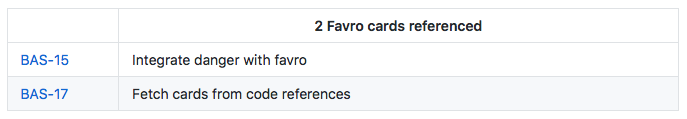

> **Warning**
> This repository is no longer maintained

---

# danger-favro

A [Danger](http://danger.systems) plugin that detect [Favro](https://favro.com) cards referenced in code or PR title and displays basic information about them.

### Example

### Usage

<blockquote>Initiate the check
  <pre>
favro.check(
  user_name: "api-user",
  api_token: "api-token",
  organization_id: "org-id",
  key: "Test"
)</pre>
</blockquote>

<blockquote>Environment variables can also be used.
  <pre>
ENV["DANGER_FAVRO_USER_NAME"] = "api-user"
ENV["DANGER_FAVRO_API_TOKEN"] = "api-token"
ENV["DANGER_FAVRO_ORGANIZATION_ID"] = "org-id"

favro.check(key: "Test")</pre>
</blockquote>

#### Methods

`check` - Check for cards.

## Development

1. Clone this repo
2. Run `bundle install` to setup dependencies.
3. Run `bundle exec rake spec` to run the tests.
4. Use `bundle exec guard` to automatically have tests run as you make changes.
5. Make your changes.
